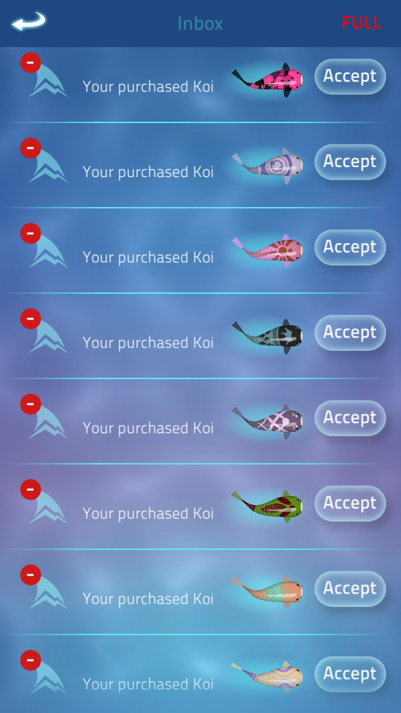

# zen koi 2

### description

small demo of impersonating an iOS client, getting in game currency and other;

if you decide to run the scripts, make sure to change the "var1" value to your player id, which you can find in the "settings" tab of the main menu

<iframe width="560" height="315" src="https://www.youtube.com/embed/t0g74CfZ0Yg" frameborder="0" allow="accelerometer; autoplay; encrypted-media; gyroscope; picture-in-picture" allowfullscreen></iframe>

### screenshots

